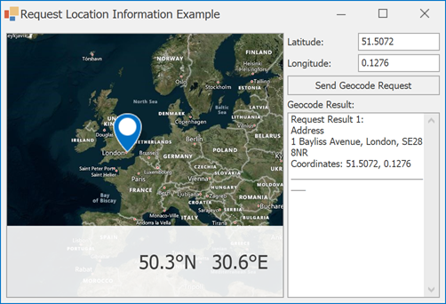

<!-- default badges list -->

<!-- default badges end -->

# Map for WinForms - Obtain Information About a Geographical Point from the Microsoft Bing Geocode Web Service

This example demonstrates how to use the [BingGeocodeDataProvider](https://docs.devexpress.com/WindowsForms/DevExpress.XtraMap.BingGeocodeDataProvider) to obtain information about a geographical point from the [Bing Geocode](https://docs.microsoft.com/en-us/bingmaps/rest-services/locations/find-a-location-by-point) web service.

To display information about a geographical point, do one of the following:

* Locate a desired geographical point on the map and click it.

* Specify coordinates of a geographical point in **Latitude** and **Longitude** text boxes and then click the **Send Geocode Request** button.

After that, the geographical point coordinates are passed to the [`BingGeocodeDataProvider.RequestLocationInformation`](https://docs.devexpress.com/WindowsForms/devexpress.xtramap.binggeocodedataprovider.requestlocationinformation.overloads) method. The response from the service contains an address ([`LocationInformation.Address`](https://docs.devexpress.com/WindowsForms/DevExpress.XtraMap.LocationInformation.Address)), the entity type ([`LocationInformation.EntityType`](https://docs.devexpress.com/WindowsForms/DevExpress.XtraMap.LocationInformation.EntityType)), and exact coordinates ([`LocationInformation.Location`](https://docs.devexpress.com/WindowsForms/DevExpress.XtraMap.LocationInformation.Location)) that are shown in the **RichTextBox** element.

> **NOTE:** You need a key to use Bing Maps services in your application. Refer to the following topic for more information: [How to: Get a Bing Maps Key](https://docs.devexpress.com/WindowsForms/15102/controls-and-libraries/map-control/examples/general/how-to-get-a-bing-maps-key).

## Files to Look At

* [Form1.cs](./CS/RequestLocationInformation/Form1.cs) (VB: [Form1.vb](./VB/RequestLocationInformation/Form1.vb))

## Documentation

* [Geocode](https://docs.devexpress.com/WindowsForms/16712/controls-and-libraries/map-control/gis-data/geocode)

## More Examples

* [How to Use the OpenStreetMap Geocode Service Via the Map Control](https://github.com/DevExpress-Examples/how-to-use-the-openstreetmap-geocode-service-via-the-map-control-t629683)
* [How to get additional search results using the Bing Maps Search service](https://github.com/DevExpress-Examples/how-to-get-additional-search-results-using-the-bing-map-search-service-e5066)
* [How to manually generate map items for location information received from the Bing Search provider](https://github.com/DevExpress-Examples/manually-generate-map-items-for-location-information-received-from-the-bing-search-provider-t188838)
* [How to calculate a route between two addresses](https://github.com/DevExpress-Examples/how-to-calculate-a-route-between-two-addresses-t364143)
